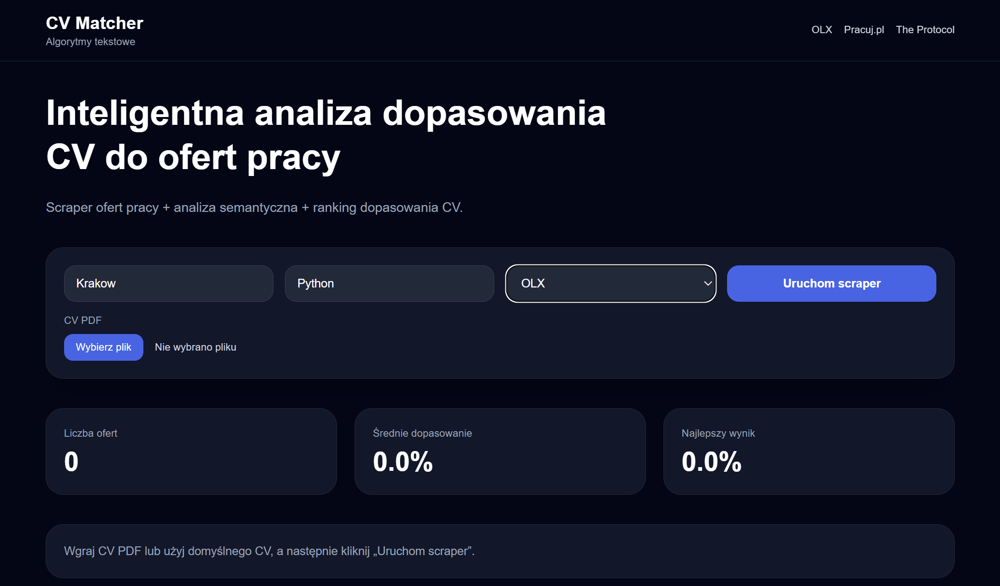
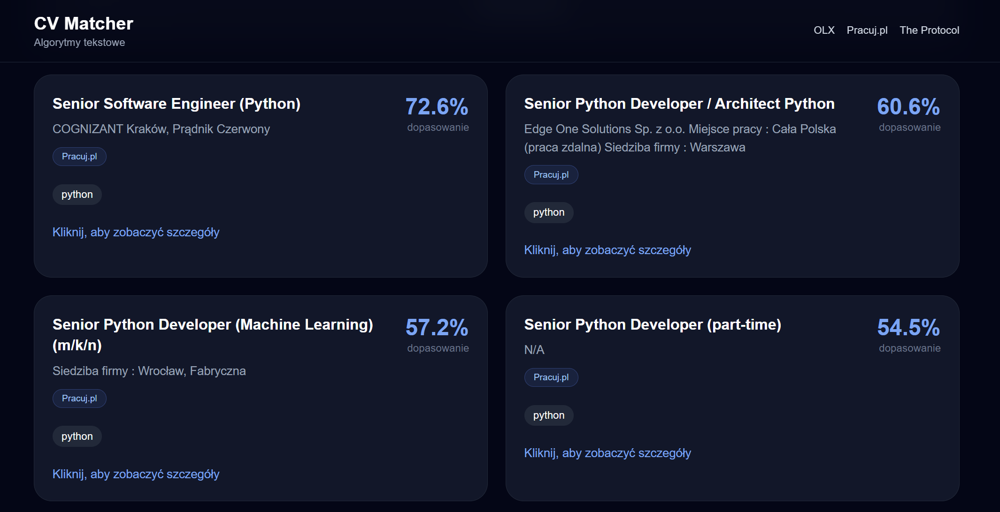
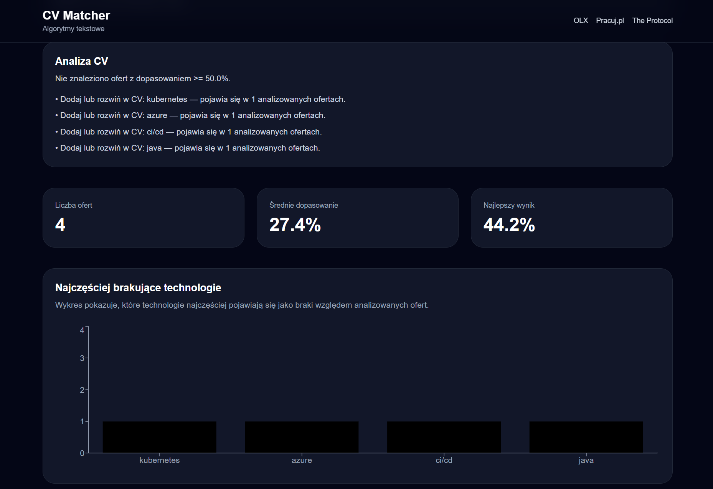
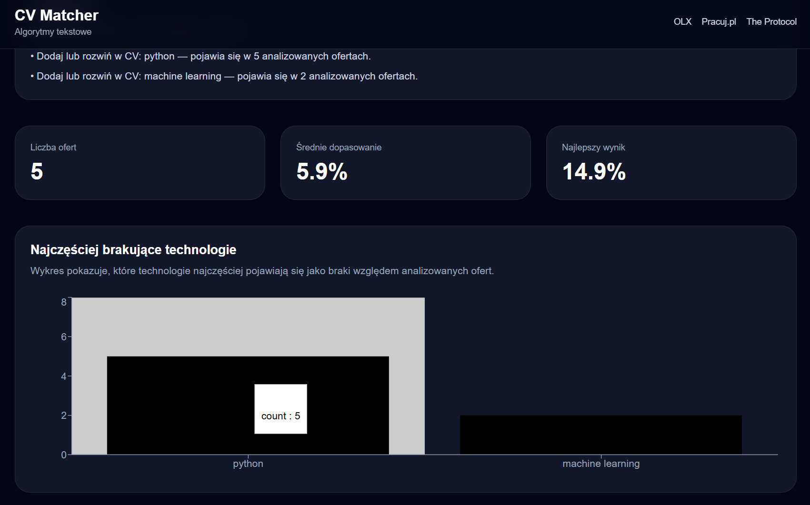

# CV Matcher

Aplikacja internetowa przeznaczona do automatycznej analizy i ewaluacji dopasowania dokumentów aplikacyjnych (CV) do aktualnych ofert pracy w branży IT. System samodzielnie agreguje ogłoszenia z popularnych portali rekrutacyjnych, analizuje ich treść za pomocą technik przetwarzania języka naturalnego (NLP), takich jak ekstrakcja słów kluczowych oraz semantyczne reprezentacje tekstu (embeddings), a następnie oblicza stopień dopasowania pomiędzy kandydatem a ofertami pracy.

Projekt zrealizowany w ramach przedmiotu **Algorytmy Tekstowe**.

## 🚀 Architektura i zasada działania

1. **Agregacja ofert (Web Scraping):** Aplikacja automatycznie pobiera aktualne ogłoszenia o pracę z serwisów takich jak OLX, Pracuj.pl oraz The Protocol.
2. **Przetwarzanie dokumentów:** Użytkownik przesyła CV w formacie PDF lub TXT. System dokonuje ekstrakcji zawartości tekstowej.
3. **Analiza semantyczna (AI/NLP):** Aplikacja przekształca tekst z CV oraz ofert pracy w wektorowe reprezentacje (embeddingi semantyczne) z wykorzystaniem modeli językowych. Ewaluacja dopasowania odbywa się poprzez obliczenie odległości kosinusowej (Cosine Similarity) pomiędzy wektorami oraz weryfikację pokrycia słów kluczowych.
4. **Prezentacja wyników:** Użytkownik otrzymuje ranking najlepiej dopasowanych ofert, listę brakujących kompetencji technicznych oraz statystyki obrazujące aktualne zapotrzebowanie rynkowe.

## 🛠️ Wykorzystane technologie i biblioteki

Architektura projektu opiera się na rozdziale warstwy logiki biznesowej (backend) oraz interfejsu użytkownika (frontend).

### Backend (Python)
- **[FastAPI](https://fastapi.tiangolo.com/):** Wydajny framework do budowy interfejsu programistycznego aplikacji (REST API), zarządzający komunikacją z aplikacją kliencką.
- **[Sentence-Transformers](https://www.sbert.net/):** Biblioteka oparta na frameworku PyTorch, dedykowana do generowania wektorowych reprezentacji tekstu (embeddingów). Umożliwia semantyczne, a nie jedynie leksykalne, dopasowanie profilu kandydata do wymagań zawartych w ofertach pracy.
- **[Scikit-learn](https://scikit-learn.org/) & [NumPy](https://numpy.org/):** Narzędzia wykorzystywane do operacji na macierzach oraz obliczeń numerycznych, w tym wyznaczania miary Cosine Similarity.
- **[PyMuPDF (fitz)](https://pymupdf.readthedocs.io/):** Biblioteka zapewniająca szybką i bezstratną ekstrakcję tekstu z dokumentów PDF przesyłanych przez użytkowników.
- **[BeautifulSoup4](https://www.crummy.com/software/BeautifulSoup/) & [curl_cffi](https://curl-cffi.readthedocs.io/):** Moduły odpowiedzialne za proces web scrapingu. Biblioteka `curl_cffi` jest wykorzystywana do symulacji zachowania przeglądarek internetowych w celu ominięcia podstawowych mechanizmów anty-scrapingowych.
- **SQLite:** Relacyjna baza danych wykorzystywana do lokalnego buforowania (cachowania) pobranych ofert pracy, co minimalizuje redundancję zapytań sieciowych i obciążenie scraperów.

### Frontend (React)
- **[React](https://react.dev/) + [Vite](https://vitejs.dev/):** Nowoczesny stos technologiczny służący do budowy responsywnego interfejsu użytkownika (SPA).
- **[TailwindCSS](https://tailwindcss.com/):** Framework CSS typu utility-first, pozwalający na implementację spójnego i modularnego systemu wizualnego.
- **[Axios](https://axios-http.com/):** Klient HTTP obsługujący asynchroniczną komunikację z backendem.
- **[Recharts](https://recharts.org/):** Biblioteka wizualizacyjna, stosowana do renderowania interaktywnych wykresów (m.in. statystyk popytu na określone technologie).

## 📂 Struktura repozytorium

```text
Algorytmy-tekstowe/
├── Algorytmy-tekstowe-scraper/   # Warstwa backendowa (API, baza danych, modele NLP)
│   ├── api.py                    # Deklaracja punktów końcowych (endpoints) FastAPI
│   ├── main.py                   # Główny algorytm dopasowywania CV
│   ├── scraper*.py               # Moduły integrujące zewnętrzne portale ogłoszeniowe
│   └── requirements.txt          # Zależności środowiska Python
│
└── Algorytmy-tekstowe-web/       # Warstwa frontendowa
    ├── src/                      # Kod źródłowy komponentów interfejsu
    ├── package.json              # Konfiguracja zależności Node.js
    └── vite.config.js            # Konfiguracja procesu budowania Vite
```

## 📸 Interfejs użytkownika

| Panel główny (Dashboard) | Ranking ofert |
| :---: | :---: |
|  |  |

| Analiza i rekomendacje | Statystyki technologii |
| :---: | :---: |
|  |  |

## ⚙️ Instrukcja uruchomienia

### 1. Klonowanie repozytorium
```bash
git clone https://github.com/mateuszstoch/Algorytmy-tekstowe.git
cd Algorytmy-tekstowe
```

### 2. Uruchomienie środowiska backendowego
Zalecane jest utworzenie izolowanego środowiska wirtualnego:
```bash
cd Algorytmy-tekstowe-scraper
python3 -m venv venv

# Aktywacja środowiska (Linux / macOS):
source venv/bin/activate
# Aktywacja środowiska (Windows):
# venv\Scripts\activate

pip install -r requirements.txt
uvicorn api:app --reload
```
Serwer API zostanie uruchomiony na porcie lokalnym: `http://127.0.0.1:8000`.
Interaktywna dokumentacja Swagger jest dostępna pod adresem: `http://127.0.0.1:8000/docs`.

### 3. Uruchomienie środowiska frontendowego
W nowej sesji terminala (przy działającym procesie backendu):
```bash
cd Algorytmy-tekstowe-web
npm install
npm run dev
```
Aplikacja kliencka jest dostępna pod adresem: `http://localhost:5173`.

## 👥 Zespół projektowy

Projekt został zrealizowany w ramach przedmiotu akademickiego **Algorytmy Tekstowe**.

Autorzy:
- Mateusz Stoch
- Konrad Siemczyk
- Julia Rzymowska
- Adam Sokołowski
